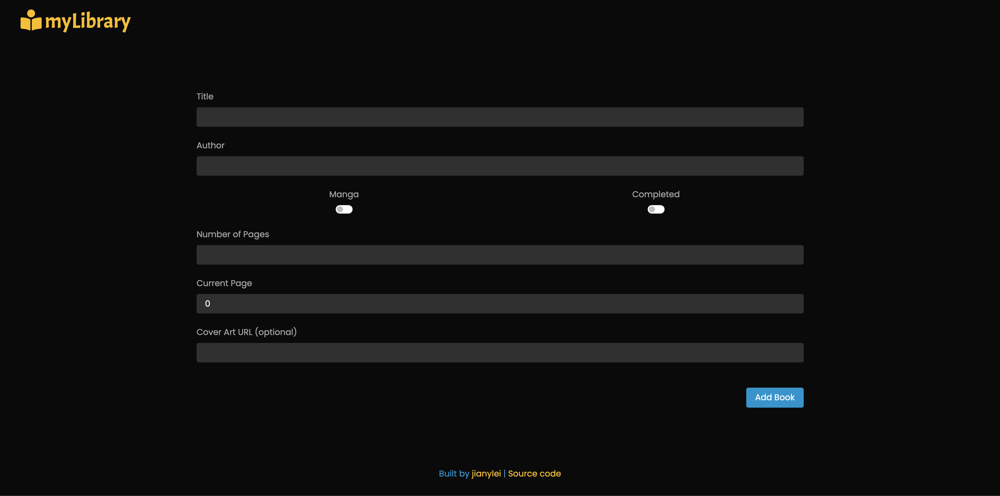
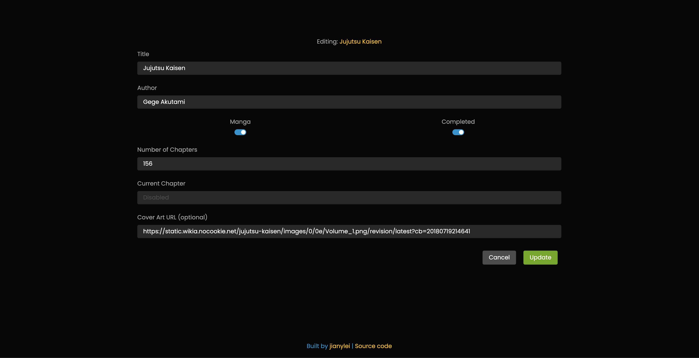
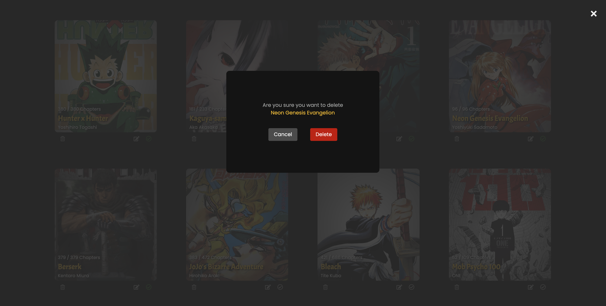
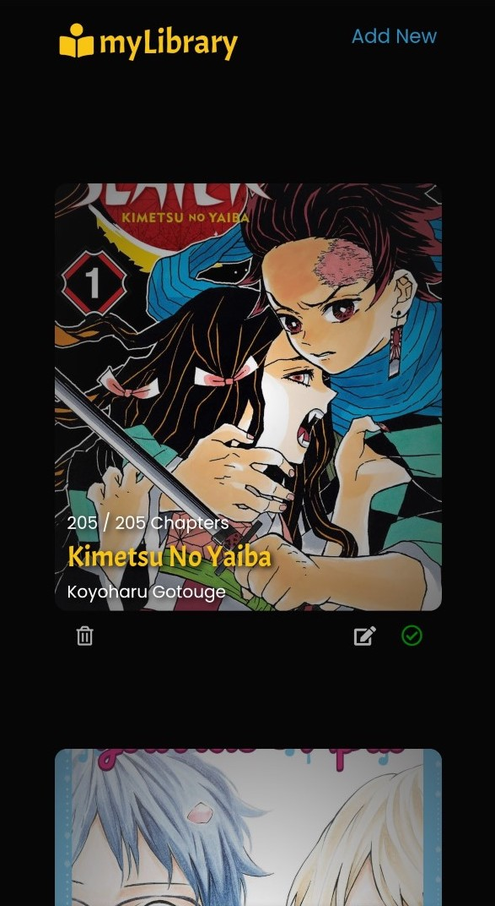
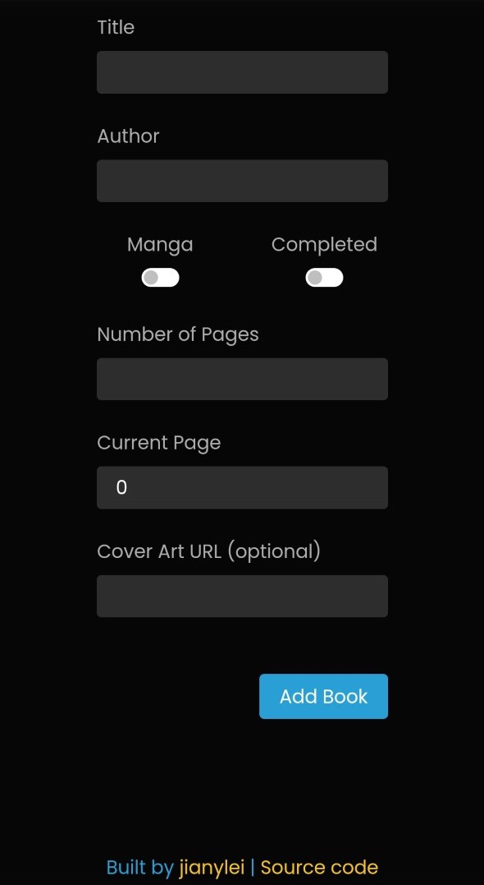
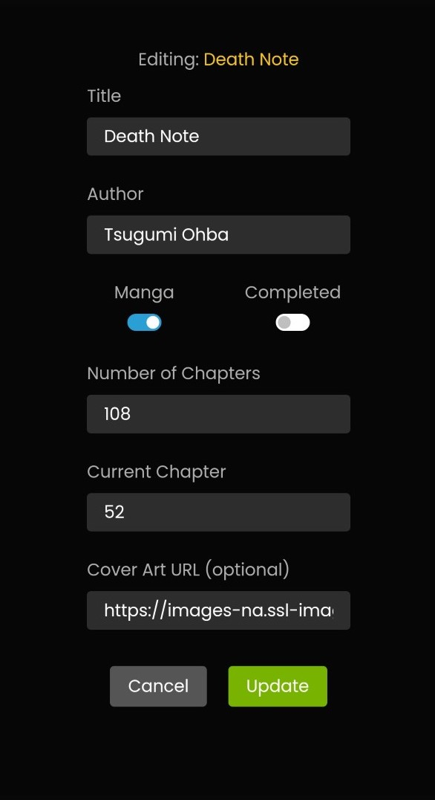

# myLibrary

<a href="https://jianylei.github.io/myLibrary/">Live App</a>

## Table of Contents
- [Introduction](#introduction)
- [Tech](#tech)
- [Features](#features)
- [Screenshots](#screenshots)
- [Todos](#todos)
## Introduction
As an avid manga reader, I can never keep track of my reading progress relative to new releases... so I created an app to solve that issue!
With built-in CRUD features, myLibrary will take care of all your "book-tracking" needs!
## Tech
Vanilla Javascript, HTML, CSS + Bootstrap
## Features
<ul>
  <li>CRUD functions</li>  
  <li>Responsive UI for Desktop & Mobile</li>  
  <li>Mark books as read</li>  
  <li>Data stored within browser (localStorage)</li>
</ul>

## Screenshots
### Home

    

### Add New

    

### Edit

    

### Delete

    

### Mobile

    
    
    
    

## Todos
<ul>
  <li>Search function</li>  
  <li>Library sorting and filtering</li> 
  <li>Register and sign-in</li>
  <li>Live database (PostgreSQL)</li>  
</ul>
